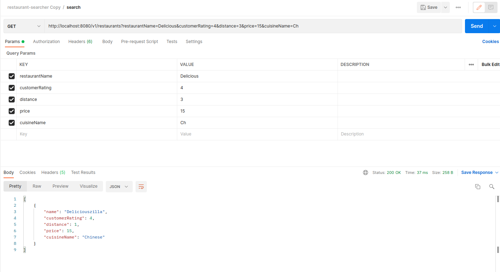
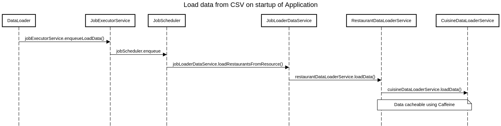
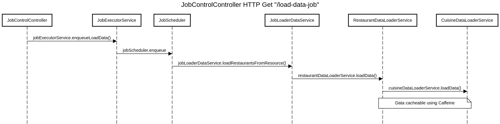
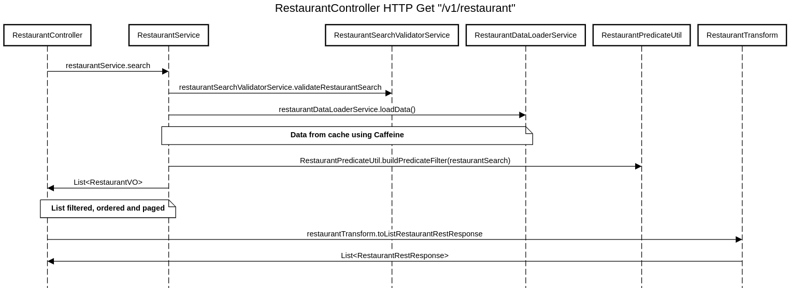

## Find the best-matched restaurants 

## System requirements:
- JDK 17
- Maven >= 3.8.4

## Used components
- Spring Boot
- Spring Boot Cache
- Caffeine - Implementation of cache mechanism
- jobrunr - Job Executor to load class
- Lombok

## Project structure packages

### com.restaurant.searcher.application

It has business logic and what the application should do.

### com.restaurant.searcher.domain

It has models, constants, exceptions to represent the domain of application

### com.restaurant.searcher.infrastructure

It has code to support application working, such as config information.

### com.restaurant.searcher.interfaces

It provides external interfaces from application. Rest and command line in this case.

### data from resources
- cuisines.csv - Data with cuisines information
- restaurants.csv - Data with restaurants information

## Commands to execute program

- Build project: mvn clean install
- Run project: mvn spring-boot:run

## How Test application after startup

### Requirements

It should be informed at least one of this request param:
- restaurantName (It should have at least 2 letters)
- customerRating (It should be an integer between 1 and 5)
- distance (It should be an integer between 1 and 10)
- price (It should be an integer between 10 and 50)
- cuisineName (It should have at least 2 letters)

### Curl sample

curl --location --request GET 'http://localhost:8080/v1/restaurants?restaurantName=deli&customerRating=4&distance=3&price=15&cuisineName=Ch'

#### Expected response
``
[{"name":"Deliciouszilla","customerRating":4,"distance":1,"price":15,"cuisineName":"Chinese"}]%
``
### Postman

You can use the file docs/postman/restaurant-searcher.postman_collection.json from postman folder to import a postman project to use as
rest tool to test the service

#### Expected response

``
[{"name":"Deliciouszilla","customerRating":4,"distance":1,"price":15,"cuisineName":"Chinese"}]%
``

## Useful URLs

- Swagger page: http://localhost:8080/docs
- Actuator page: http://localhost:8080/actuator
- Job monitor page: http://localhost:8000/dashboard/overview
- Application: http://localhost:8080

## Logging

- If you would like to change level log to debug, you should change this property on resource/application.properties file
logging.level.com.restaurant.searcher=DEBUG
- You should use this config to production mode outside of a debug situation:
logging.level.com.restaurant.searcher=INFO

## How application works

### Load data from CSV on startup of Application

## JobControlController HTTP Get "/load-data-job"

## RestaurantController HTTP Get "/load-data-job"

